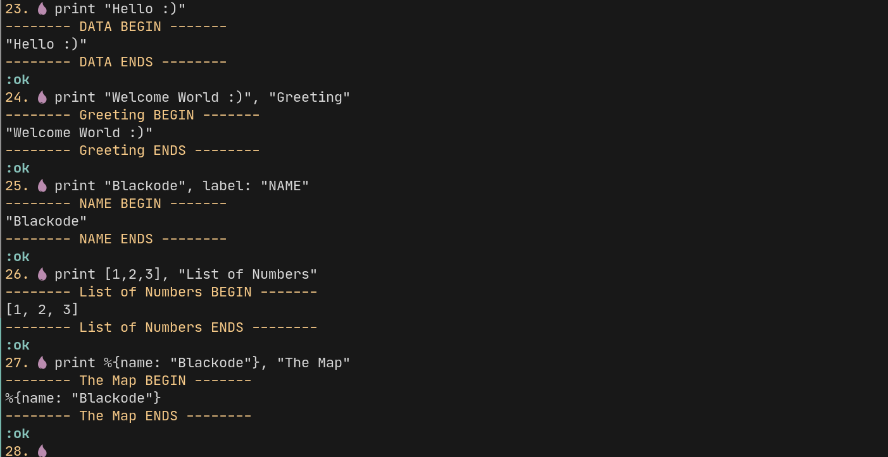
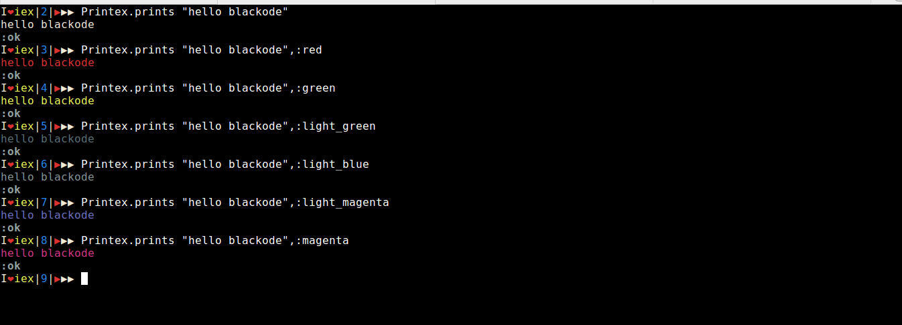
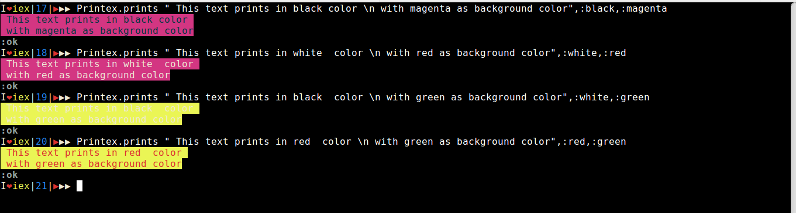
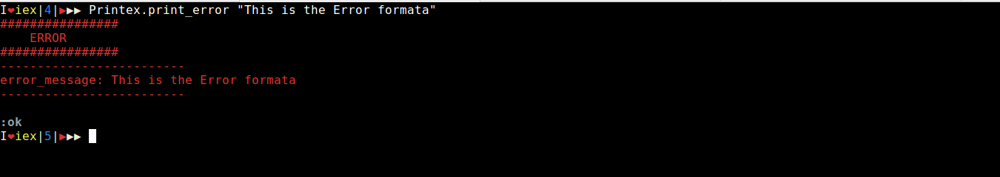
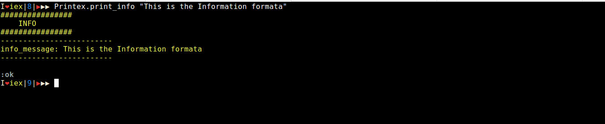
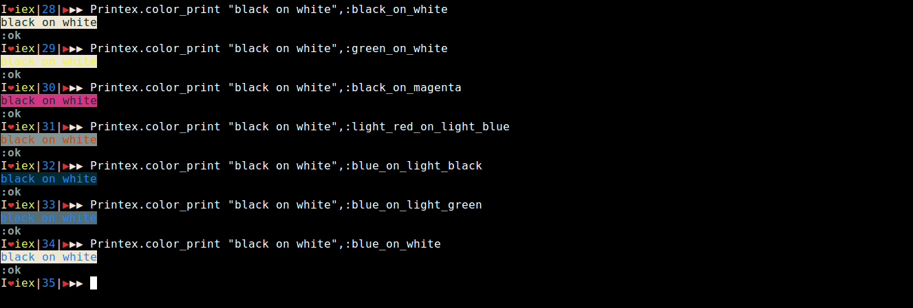

# Printex
Printex is a Color Printer Module,helps you to print the data and strings in color format in console.                     

## Use
This module separates the different console outputs with different colors and including background colors as well. It gives you the direct focus on the console by highlighting text with colors and backgrounds.                             

You can use in multiple ways like printing the :error message and many formats. This helps you identify message from the regular out put of the console. You can also specify the :bg_color - Background color for the text to lay on.

## Installation

[Download from Hex](https://hex.pm/docs/publish), the package can be installed
by adding `printex` to your list of dependencies in `mix.exs`:

```elixir
def deps do
  [{:printex, "~> 1.1.0"}]
end
```
[Documentation](https://hexdocs.pm/printex).            

## Screenshots
### print


### prints with foreground colors


### prints with background colors


### Printing the Warning Text


### Printing the Error Text


### Printing the Info Text


### Smart printing



